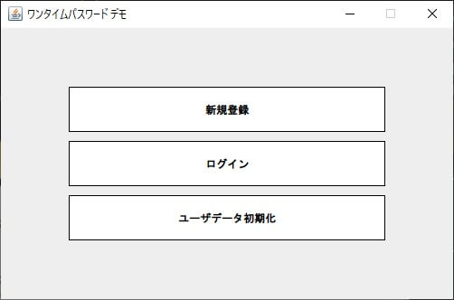
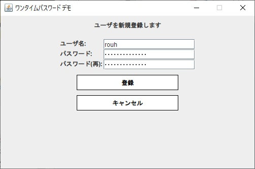
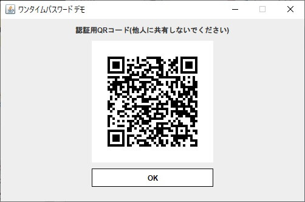
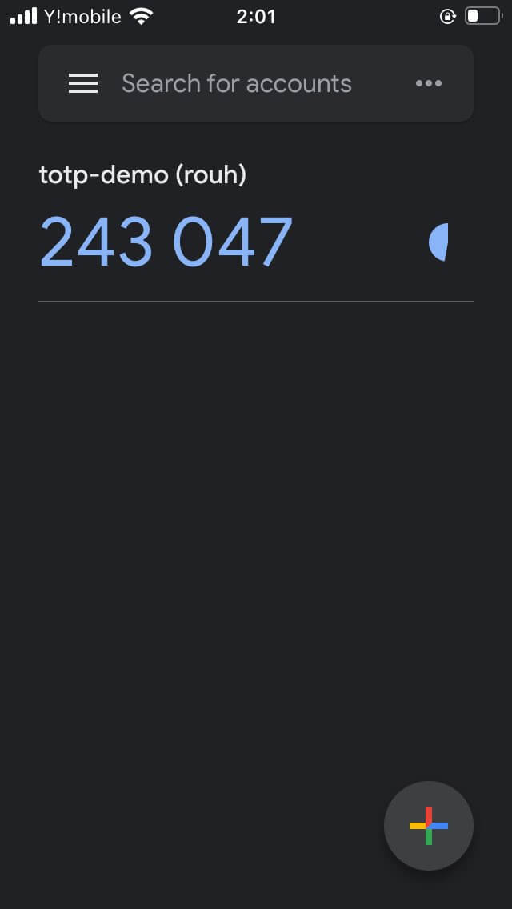
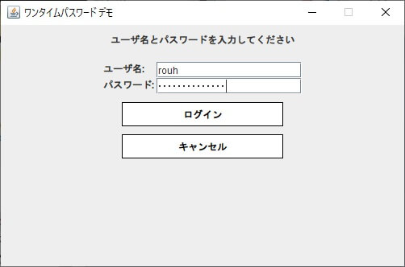
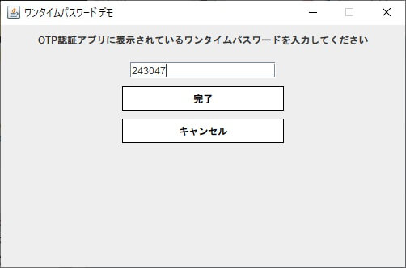
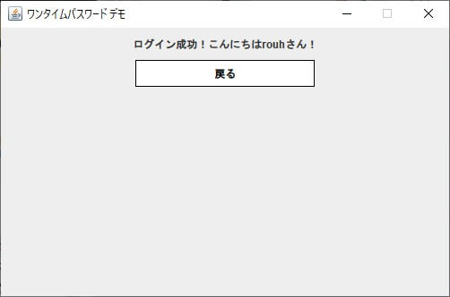

# TOTP認証のデモアプリケーション

TOTP(時間ベース・ワンタイムパスワード)を独自で実装し、
デスクトップアプリケーション上で実際にOTP認証によるログインを試すアプリケーション。

### 実際の画面

(1)アプリケーションを実行する

(2)ユーザを新規追加する

(3)QRコードが表示される

(4)Google Authenticator でQRコードを読み込む

Authenticator 上で6桁のOTPが表示される(30秒ごとに更新される)

(5)ログインする

(6)Authenticator に表示されたOTPを入力する

(7)ログインに成功する

### 開発技術

開発言語:
* Java SE 11

統合開発環境:
* IntelliJ IDEA

ビルドツール:
* Gradle

使用外部ライブラリ:
* apache-commons(Base32エンコーダ)
* zxing(QRコード画像生成)

使用Java標準ライブラリ:
* swing (javax.swing)
* HMAC-SHA1 (javax.crypto)

### ソースコード解説

独自GUIフレームワーク部分(jp.rouh.totp.clientパッケージ)
* Scene ... 画面の抽象クラス
* SceneContext ... 画面遷移用コンテキスト
* SceneId ... 画面ID enumクラス

GUI部分(jp.rouh.totp.clientパッケージ)
* Application ... アプリケーション(実行可能クラス)
* LoginOtpScene ... OTPログイン画面
* LoginScene ... ログイン画面
* QRCodeScene ... QRコード表示画面
* RegisterScene ... ユーザ登録画面
* UserScene ... ユーザ情報画面

モデル部分(jp.rouh.totp.modelパッケージ)
* ApplicationService ... 画面から実行される処理のファサードインターフェース
* ApplicationServiceImpl ... 上記インターフェースの標準実装クラス
* SecurityUtils ... ハッシュやTOTP関連の処理をまとめたユーティリティクラス

データ永続化(jp.rouh.totp.modelパッケージ)
* DataManager ... データ永続化インターフェース
* PropertyBasedDataManager ... プロパティによるデータ永続化の実装クラス
